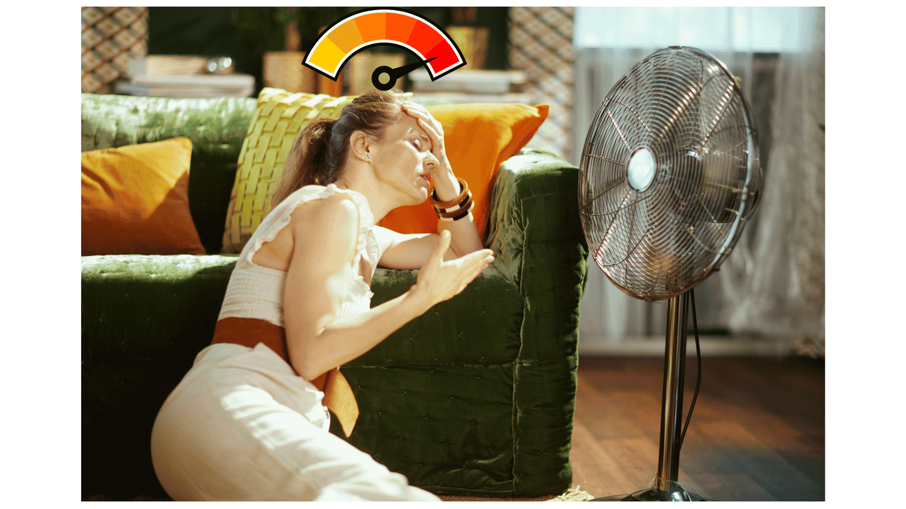

Ces dernières années, les épisodes de chaleur extrême se sont multipliés. Un phénomène qui peut engendrer une augmentation des hospitalisations et de la mortalité. Pour prévenir ces risques, les instances de santé publique recommandent alors de limiter les efforts physiques trop intenses, de boire beaucoup d’eau, de fréquenter des lieux climatisés et de fermer les rideaux le jour. 

Mais à partir de quand la température à l'intérieur d'un logement devient-elle réellement problématique pour la santé?  [Voir plus ici](https://nouvelles.umontreal.ca/article/2026/07/08/un-laboratoire-sur-la-chaleur-dans-le-salon)

{fig-align="center" fig-alt="Apercu de l'article de vulgarisation"}

